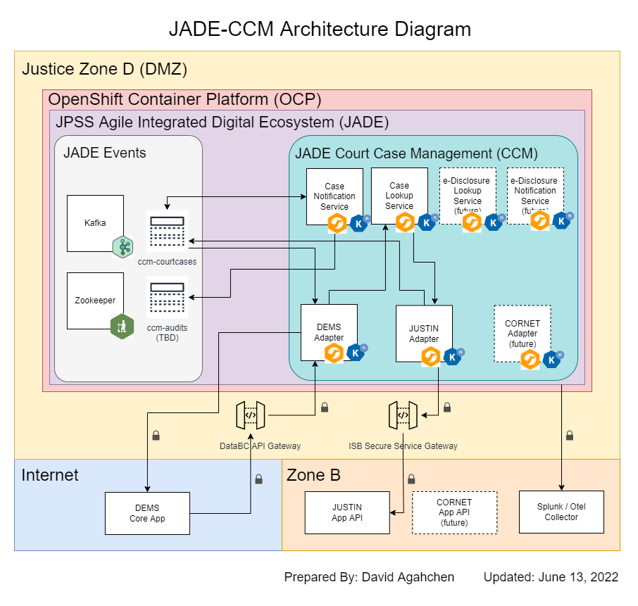

# JPSS Agile-integrated Digital Ecosystem - Court Case Management Integration Solution

BC Prosecution Services (BCPS) is implementing a Digital Evidence & Disclosure Management Solution (DEMS) which will house police evidence and disclosure, electronically. BCPS is working in partnership with the Cascadia and EDT company who are providing the overall evidence management application.

The ISB Integration Delivery Service Team is responsible for providing the integration solution between EDT DEMS application and Ministry applications needed in the overall solution called JUSTIN and CORNET.

For the ISB Integration Delivery Service Team to successfully deliver a working solution (JADE-CCM), they will need to work in partnership with the DEMS project other service providers, the EDT Team responsible for the DEMS product and NTT Data responsible for JUSTIN and CORNET application changes.

## Technical Architecture Diagram

JADE-CCM integrates between a court case managmeent system (JUSTIN), a digital edvidence management system (DEMS), and a corrections managemnt system (CORNET.)

JADE-CCM is an integration solution within the newly created Justice sector digital ecosystem platform JADE.  Within JADE is a Red Hat supported Kafka event notification cluster called JADE-Events.  Deployed alongside JADE-CCM, JADE-Events functions as a communications backplane and an event store for all notification topics.

## Integrated Development Environment (IDE) and Extensions

JADE-CCM is developed using the Visual Studio Code IDE.  The freely downloadable IDE tool can be downloaded from Microsoft's official web site: https://code.visualstudio.com .  For Apple Mac developers, you can also install the tool via Homebrew (https://brew.sh) and the cask formulae https://formulae.brew.sh/cask/visual-studio-code#default .

Core extensions:

* Extension Pack for Apache Camel by Red Hat

Additional, development and diagramming extensions:

* PlantUML
* Draw.io Integratoin

## Known Re-Queuable JUSTIN Change Notifications in Dev

The following re-queuable Dev JUSTIN change notifications will be used to support "create case in DEMS" (5.2.1) and "sync user list in DEMS" (5.3.1) functional development.

| event_type | event_message_id | RCC_ID |
| --- | --- | --- |
| AGEN_FILE | 2045 | 50419.0734 |
| AGEN_FILE | 2060 | 50422.0734 |
| AGEN_FILE | 2063 | 50422.0734 |
| AGEN_FILE | 2064 | 50419.0734 |
| AUTH_LIST | 2065 | 50419.0734 |
| AGEN_FILE | 2071 | 50420.0734 |
| AUTH_LIST | 2072 | 50420.0734 |
| AUTH_LIST | 2077 | 50421.0734 |
| AGEN_FILE | 2078 | 50421.0734 |

Postman collection file for JUSTIN APIs: tools/JUSTIN-DEMS.postman_collection.json

## Deploy JADE-Events Cluster to Dev Environment in OCP Silver Cluster (cef5dd-dev)

Requires installation of the oc command line interface tool (visit download page from OCP Silver Cluster [here](https://console.apps.silver.devops.gov.bc.ca/command-line-tools).)

Steps

* Login to OCP Silver Cluster https://console.apps.silver.devops.gov.bc.ca/
* Copy login command from OpenShift console and paste into a command line window configured to execute the oc command
* Execute: oc -n cef5dd-dev apply -f tmp-argocd/events/np-workarounds/workaround-np-kafka.yaml
* Execute: oc -n cef5dd-dev apply -f tmp-argocd/events/np-workarounds/workaround-np-zookeeper.yaml
* Execute oc -n cef5dd-dev apply -f tmp-argocd/events/create-events-cluster-in-silver-cef5dd-dev.yaml

## Deploy JADE-CCM Components to Dev Environment in OCP Silver Cluster (cef5dd-dev)

Requires installation of the kamel command line interface tool (visit download page from OCP Silver Cluster [here](https://console.apps.silver.devops.gov.bc.ca/command-line-tools).)

Steps

* Login to OCP Silver Cluster https://console.apps.silver.devops.gov.bc.ca/
* Copy login command from OpenShift console and paste into a command line window configured to execute the kamel command
* Change directory to: src
* Execute: . ./redeploy-ccm-all

## Test APIs Using Postman

Working directory: tools/postman

| Type | File Name | Description |
| ---  | ---       | ----        |
| Postman Collection | DEMS Integration APIs.postman_collection.json | An IDS team-managed collection of DEMS, ISL and JUSTIN APIs |
| Postman Environment Settings | Dev.postman_environment.json | An IDS team-managed environment settings file for Dev |
| Postman Collection | JUSTIN-DEMS.postman_collection.json | An NTTData team-managed collection of JUSTIN APIs, downloaded from NTTData story ticket [BCPSDEMS-218](https://justice.gov.bc.ca/jira/browse/BCPSDEMS-218) (Develop AgencyFile.GET) | 

## Download and Run Atlasmap Mapping UI

AtlasMap provides a GUI to define JSON to JSON transformation.  The map can then be used in a Camel component.

Documentation: https://docs.atlasmap.io/#quickstart

Using with Camel 3 including example: https://docs.atlasmap.io/#running-with-apache-camel-3-x

Version used: 2.3.18

JUSTIN Sample JSON files as Atlasmap source: tools/atlasmap/justin-sample-data/*

Steps

* Execute: java -jar tools/atlasmap/lib/atlasmap-standalone-2.3.18.jar
* Open URL: http://localhost:8585

## Guides

* Camel Quarkus: https://camel.apache.org/camel-quarkus/2.9.x/user-guide/first-steps.html
* Integration Systems with Apache Camel and Quarkus on Red Hat OpenShift: https://developers.redhat.com/articles/2021/05/17/integrating-systems-apache-camel-and-quarkus-red-hat-openshift#
* Camel Quarkus Examples: https://github.com/jboss-fuse/camel-quarkus-examples/tree/camel-quarkus-examples-1.6.0-product/file-bindy-ftp
* Unmarshalling a JSON Array Using camel-jackson: https://www.baeldung.com/java-camel-jackson-json-array
* Youtube video (30 min): [Getting started with Apache Camel on Quarkus](https://www.youtube.com/watch?v=POWsZnGhVHM)