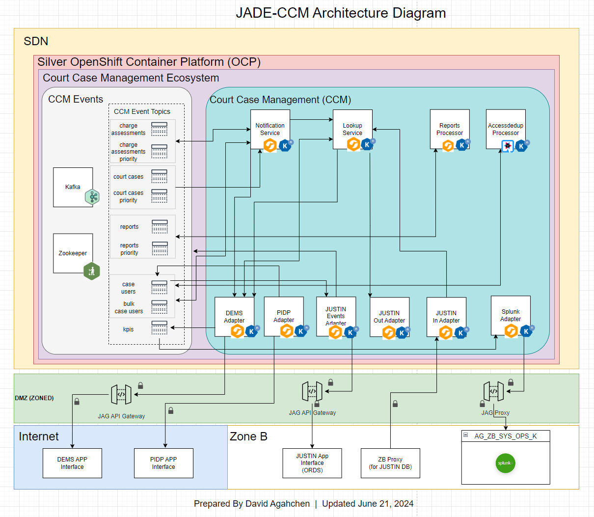
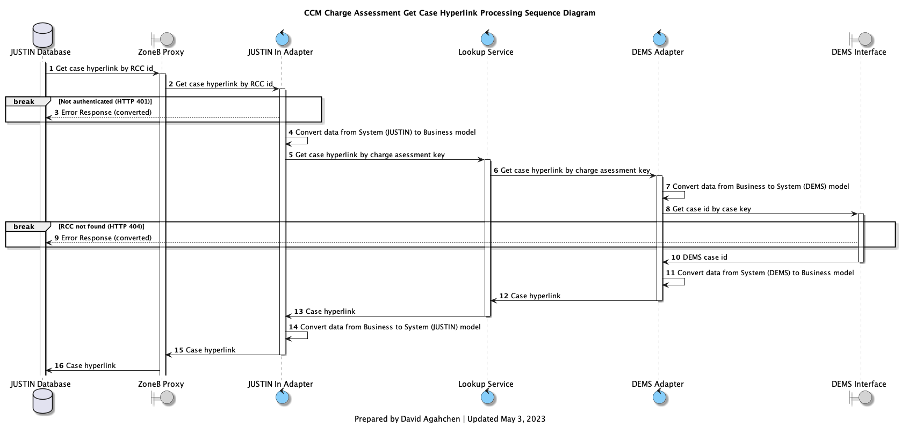

Return to [JADE-CCM repo README doc](../README.md).

# JPSS Agile-integrated Digital Ecosystem - Court Case Management (JADE-CCM) Integration Solution

BC Prosecution Services (BCPS) is implementing a Digital Evidence & Disclosure Management Solution (DEMS) which will house police evidence and disclosure, electronically. BCPS is working in partnership with the Cascadia and EDT company who are providing the overall evidence management application.

The ISB Integration Delivery Services Team is responsible for providing the integration solution between EDT DEMS application and Ministry applications needed in the overall solution called JUSTIN and CORNET.

For the ISB Integration Delivery Services Team to successfully deliver a working solution (JADE-CCM), they will need to work in partnership with the DEMS project other service providers, the EDT Team responsible for the DEMS product and NTT Data responsible for JUSTIN and CORNET application changes.

To learn more about JADE and the Justice and Public Sector Integration Delivery Service, please visit: https://integrations.justice.gov.bc.ca/

---
## Technical Architecture Diagram

JADE-CCM is an integration solution within the newly created Justice sector digital ecosystem platform JADE.  Within JADE is a Red Hat supported Kafka event notification cluster called JADE-Events.  Deployed alongside JADE-CCM, JADE-Events functions as a communications backplane and an event store for all notification topics.

JADE-CCM integrates between a court case managmeent system (JUSTIN), a digital edvidence management system (DEMS), and a corrections managemnt system (CORNET.)

This technical architecture diagram is created using the Draw.io diagramming tool (source here located <a href="../diagrams/ccm_architecture_diagram.drawio">here</a>).

In addition, this powerpoint summarizes the [JADE Scaling Approach (updated March 2023)](../docs/JADE%20scaling%20approach%202023-03.pptx).

---

## Event Processing Sequence Diagrams

JADE-CCM event processing sequence diagrams are created using the PlantUML sequence diagramming tool.

| Business Object | Event | Processing Diagram (and source) |
| --- | --- | --- |
| All | JUSTIN Events | [Diagram](../diagrams/img/ccm_justin_event_processing_sequence_diagram.png) ([source](../diagrams/ccm_justin_event_processing_sequence_diagram.plantuml))|
| Charge Assessment | MANUALLY_CHANGED |[Diagram](../diagrams/img/ccm_charge_assessment_case_manually_changed_processing_sequence_diagram.png) ([source](../diagrams/ccm_charge_assessment_case_manually_changed_processing_sequence_diagram.plantuml))|
| Charge Assessment | CHANGED |[Diagram](../diagrams/img/ccm_charge_assessment_case_changed_processing_sequence_diagram.png) ([source](../diagrams/ccm_charge_assessment_case_changed_processing_sequence_diagram.plantuml))|
| Charge Assessment | CREATED |[Diagram](../diagrams/img/ccm_charge_assessment_case_created_processing_sequence_diagram.png) ([source](../diagrams/ccm_charge_assessment_case_created_processing_sequence_diagram.plantuml))|
| Charge Assessment | UPDATED |[Diagram](../diagrams/img/ccm_charge_assessment_case_updated_processing_sequence_diagram.png) ([source](../diagrams/ccm_charge_assessment_case_updated_processing_sequence_diagram.plantuml))|
| Charge Assessment | AUTH_LIST_CHANGED |[Diagram](../diagrams/img/ccm_charge_assessment_case_auth_list_changed_processing_sequence_diagram.png) ([source](../diagrams/ccm_charge_assessment_case_auth_list_changed_processing_sequence_diagram.plantuml))|
| Charge Assessment | INFERRED_AUTH_LIST_CHANGED |[Diagram](../diagrams/img/ccm_charge_assessment_case_inferred_auth_list_changed_processing_sequence_diagram.png) ([source](../diagrams/ccm_charge_assessment_case_inferred_auth_list_changed_processing_sequence_diagram.plantuml))|
| Court Case | CHANGED |[Diagram](../diagrams/img/ccm_approved_court_case_changed_processing_sequence_diagram.png) ([source](../diagrams/ccm_approved_court_case_changed_processing_sequence_diagram.plantuml))|
| Court Case | APPEARANCE_CHANGED |[Diagram](../diagrams/img/ccm_approved_cort_case_appearance_changed_processing_sqeuencing_diagram.png) ([source](../diagrams/ccm_approved_cort_case_appearance_changed_processing_sqeuencing_diagram.plantuml))|
| Court Case | CROWN_ASSIGNMENT_CHANGED |[Diagram](../diagrams/img/ccm_approved_court_case_crown_assignment_changed_processing_sequence_diagram.png) ([source](../diagrams/ccm_approved_court_case_crown_assignment_changed_processing_sequence_diagram.plantuml))|
| Case User | ACCOUNT_CREATED |[Diagram](../diagrams/img/ccm_case_user_account_created_processing_sequence_diagram.png) ([source](../diagrams/ccm_case_user_account_created_processing_sequence_diagram.plantuml))|
| Case User | ACCESS_ADDED |[Diagram](../diagrams/img/ccm_case_user_access_added_processing_sequence_diagram.png) ([source](../diagrams/ccm_case_user_access_added_processing_sequence_diagram.plantuml))|
| Case User | ACCESS_REMOVED |[Diagram](../diagrams/img/ccm_case_user_access_removed_processing_sequence_diagram.png) ([source](../diagrams/ccm_case_user_access_removed_processing_sequence_diagram.plantuml))|
| Case User | EVENT_BATCH_ENDED |[Diagram](../diagrams/img/ccm_case_user_event_batch_ended_processing_sequence_diagram.png) ([source](../diagrams/ccm_case_user_event_batch_ended_processing_sequence_diagram.plantuml))|

### Example Event Processing Diagram 

---

## Command (API) Processing Sequence Diagrams

JADE-CCM command processing sequence diagrams are created using the PlantUML sequence diagramming tool.

| Business Object | API | Processing Diagram (and source) |
| --- | --- | --- |
| Charge Assessment | GetCaseHyperlink |[Diagram](../diagrams/img/ccm_charge_assessment_get_case_hyperlink_processing_sequence_diagram.png) ([source](../diagrams/ccm_charge_assessment_get_case_hyperlink_processing_sequence_diagram.plantuml))|

### Example Commnand Processing Diagram

---
## State Diagrams

JADE-CCM state diagrams are created using the PlantUML state diagramming tool.  PlantUML state diagrams are redenered using the GrpahViz dot rendering program.

| Link to diagram (and source file) |
| --- |
|[DEMS Case Business State Diagram](../diagrams/img/ccm_dems_case_state_diagram.png) ([source](../diagrams/ccm_dems_case_state_diagram.drawio))|

### Example State Diagram

Installation instructions for GraphViz dot is available [here](https://plantuml.com/graphviz-dot).

---

## Integrated Development Environment (IDE) and Extensions

JADE-CCM is developed using the Visual Studio Code IDE.  The freely downloadable IDE tool can be downloaded from Microsoft's official web site: https://code.visualstudio.com .  For Apple Mac developers, you can also install the tool via Homebrew (https://brew.sh) and the cask formulae https://formulae.brew.sh/cask/visual-studio-code#default .

Core extensions:

* Extension Pack for Apache Camel by Red Hat

Additional, development and diagramming extensions:

* PlantUML
* Draw.io Integration

Note:

PlantUML requires a separate installation of GraphViz dot in order to render network graphs, such as state diagrams.  See installation instructions mentioend in the "State Diagrams" section above.

---

## Java

JADE-CCM is built on Camel K, and requires compilation of the Plain-Old Java Object (POJO) data models using OpenJDK 11.

---
## Deploy JADE-Events Cluster to Dev Environment in OCP Silver Cluster (cef5dd-dev)

Requires installation of the oc command line interface tool (visit download page from OCP Silver Cluster [here](https://console.apps.silver.devops.gov.bc.ca/command-line-tools).)

Steps

* Login to OCP Silver Cluster https://console.apps.silver.devops.gov.bc.ca/
* Copy login command from OpenShift console and paste into a command line window configured to execute the oc command
* Execute: oc -n cef5dd-dev apply -f tmp-argocd/events/np-workarounds/workaround-np-kafka.yaml
* Execute: oc -n cef5dd-dev apply -f tmp-argocd/events/np-workarounds/workaround-np-zookeeper.yaml
* Execute oc -n cef5dd-dev apply -f tmp-argocd/events/create-events-cluster-in-silver-cef5dd-dev.yaml

---
## Deploy JADE-CCM Components to Dev Environment in OCP Silver Cluster (cef5dd-dev)

Requires installation of the kamel command line interface tool (visit download page from OCP Silver Cluster [here](https://console.apps.silver.devops.gov.bc.ca/command-line-tools).)

Steps

* Login to OCP Silver Cluster https://console.apps.silver.devops.gov.bc.ca/
* Copy login command from OpenShift console and paste into a command line window configured to execute the kamel command
* Change directory to: src
* Execute: . ./redeploy-ccm-all

---
## Test APIs Using Postman

Working directory: tools/postman

| Type | File Name | Description |
| ---  | ---       | ----        |
| Postman Collection | DEMS Integration APIs.postman_collection.json | An IDS team-managed collection of DEMS, ISL and JUSTIN APIs |
| Postman Environment Settings | Dev.postman_environment.json | An IDS team-managed environment settings file for Dev |
| Postman Collection | JUSTIN-DEMS.postman_collection.json | An NTTData team-managed collection of JUSTIN APIs, downloaded from NTTData story ticket [BCPSDEMS-218](https://justice.gov.bc.ca/jira/browse/BCPSDEMS-218) (Develop AgencyFile.GET) | 

---
## Additional Documentation
* [JADE Scaling Approach (updated March 2023)](../docs/JADE%20scaling%20approach%202023-03.pptx)
* [EDT Core API Endpoints Summary (updated April 13, 2023)](../mapping/docs/EDT%20Core%20API%20Endpoints%202023-04-13.md)

---
## Guides

* Camel Quarkus: https://camel.apache.org/camel-quarkus/2.9.x/user-guide/first-steps.html
* Integration Systems with Apache Camel and Quarkus on Red Hat OpenShift: https://developers.redhat.com/articles/2021/05/17/integrating-systems-apache-camel-and-quarkus-red-hat-openshift#
* Camel Quarkus Examples: https://github.com/jboss-fuse/camel-quarkus-examples/tree/camel-quarkus-examples-1.6.0-product/file-bindy-ftp
* Unmarshalling a JSON Array Using camel-jackson: https://www.baeldung.com/java-camel-jackson-json-array
* Youtube video (30 min): [Getting started with Apache Camel on Quarkus](https://www.youtube.com/watch?v=POWsZnGhVHM)

---
## Other Links
* [OCIO Private OpenShift Platform Architecture Diagram](https://cloud.gov.bc.ca/private-cloud/platform-architecture-diagram/) (first login with IDIR via button on page, and then re-access the link)